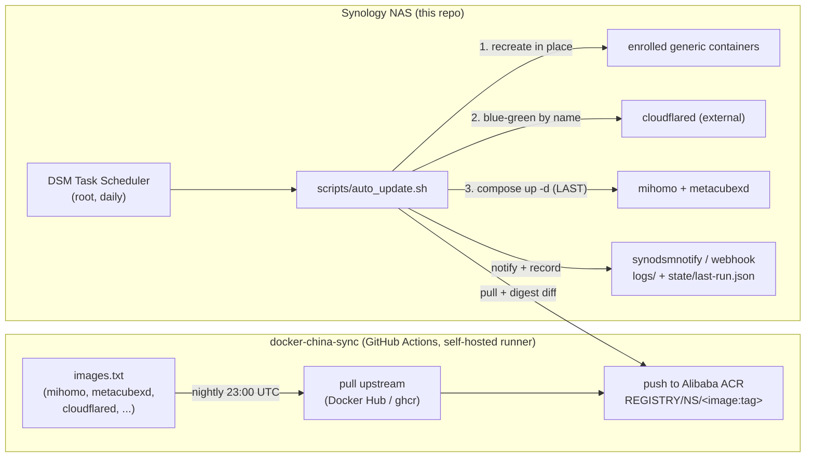

# Architecture

[← README](../README.md) · [中文](zh/architecture.md)
Manual: **Architecture** · [Installation](installation.md) · [Release Zip](release-packaging.md) · [Configuration](configuration.md) · [Auto-Update](auto-update.md) · [Operations](operations.md) · [CLI](cli.md) · [Troubleshooting](troubleshooting.md) · [Development](development.md)

---

## What this is

A transparent proxy **gateway** — born on a Synology NAS, and deployable on any
Docker-capable Linux host (amd64 + arm64). [Mihomo](https://github.com/MetaCubeX/mihomo)
(Clash Meta) runs in a privileged container with its **own LAN IP** (Docker macvlan), so any
device on the home network can route through it just by setting that IP as its gateway/DNS —
no client software required. [MetaCubeXD](https://github.com/MetaCubeX/metacubexd) is a web
dashboard for managing Mihomo.

| Platform | Compose mode (this page's topology) | Lite mode (no Docker) | Support tier |
|---|---|---|---|
| **Synology DSM** | ✓ — the canonical deployment | — | **Required owner validation** |
| **Raspberry Pi** | ✓ (64-bit OS, wired Ethernet) | ✓ | Experimental |
| **Generic Linux (amd64/arm64)** | ✓ (64-bit OS, wired Ethernet, macvlan-viable network) | ✓ | Experimental |

Tier definitions and the per-platform walkthrough:
[Installation — Generic Linux & Raspberry Pi](installation-linux.md#support-tiers).

### Canonical deployment: Synology DSM

The canonical deployment is a **Synology NAS in mainland China**, where Docker Hub /
ghcr.io are blocked. By default (`REGISTRY_MODE=acr`) image updates therefore flow through a
two-stage pipeline (mirror → pull) described below; `REGISTRY_MODE=docker` is an opt-in that
pulls upstream registries directly, for a host with unfiltered internet access (and the
default the generic-Linux installer offers).

## Components

| Component | Where | Role |
|---|---|---|
| **mihomo** | this repo, container `mihomo` | The proxy engine. Privileged, on a macvlan with a static LAN IP (`MIHOMO_IP`). Serves DNS on `:53`, the RESTful controller on `:CONTROLLER_PORT`, and proxy ports `7890-7894`. Renders its own config at start from a template. |
| **metacubexd** | this repo, container `mihomo-ui` | Static web dashboard (bridge network, published on the NAS host IP at `WEB_UI_PORT`). A browser talks to the controller directly; the container is just serving the SPA. |
| **cloudflared** | **external** (not in this compose) | Optional Cloudflare Tunnel. Managed *by name* by the auto-updater via blue-green. Lets you reach the dashboard/NAS from outside without opening ports. |
| **enrolled generic targets** | **external** (any container on the NAS) | Opt-in auto-update targets: containers enrolled via `gateway.sh update --enable` and recreated in place by the updater with a tiered health gate. See [Auto-Update](auto-update.md). |
| **auto_update.sh** | this repo, `scripts/` | DSM-scheduled job: pulls the compose images, cloudflared, and every enrolled generic target; detects real changes; applies serially, lowest blast radius first (health gates + rollback); records `state/last-run.json`; notifies. |
| **gateway.sh / install.sh** | this repo, `scripts/gateway.sh` + `./install.sh` | Operator entry points over the same `scripts/lib` functions: `gateway.sh` is the non-interactive CLI (`deploy` / `redeploy` / `modify` / `cron` / `status` / `doctor` / `update`, root + `--yes` guardrails, exit codes 0/2/3/4/5/6/7, `--json` on the read-only verbs — see [CLI](cli.md)); `install.sh` is the interactive TTY front-end ([Installation](installation.md)). |
| **data directory** | **sibling dir** `../syno-mihomo-gateway-data` | Persistent runtime state (`GATEWAY_DATA_DIR`): the live `.env`, rendered config, logs, updater state. Survives replacing the release directory. See below. |
| **docker-china-sync** | sibling repo `../docker-china-sync` | GitHub Actions on a self-hosted runner; mirrors upstream images → Alibaba ACR nightly. The "push" side of the pipeline (used when `REGISTRY_MODE=acr`, the default). |

The same components also run on a **generic Linux host or Raspberry Pi**
(`sudo sh ./install-linux.sh` / `sudo sh ./install-pi.sh` — additive entries; the DSM path above is
untouched) in one of two flavors: *compose parity* (this exact container topology on wired
macvlan) or *bare-metal lite* (the mihomo binary under systemd, serving the dashboard itself
via `external-ui` — no Docker, no macvlan; the host's own IP is the clients' gateway/DNS).
Hardware floors and mode selection:
[Installation — Generic Linux & Raspberry Pi](installation-linux.md#hardware--mode-matrix).

## Persistent data directory

Runtime state lives in a **sibling** of the release checkout — `../syno-mihomo-gateway-data`
(relocatable via `GATEWAY_DATA_DIR`):

```
../syno-mihomo-gateway-data/
├── .env        # the live settings + secrets (a repo-root .env is only a one-time migration source)
├── config/     # rendered config.yaml + subscription.txt
├── logs/       # install.log, auto-update.log, gateway.log (one per tool; linked into one file when gateway.sh runs first)
└── state/      # update-targets (enrollment), last-run.json, last-good/<name>
```

This split is the **survivability boundary**: the repo/release directory is replaceable (a
release zip can be unpacked over it), the data directory is not. Because the live `.env` is
outside the repo, compose commands always pass it explicitly:
`docker compose --env-file ../syno-mihomo-gateway-data/.env ...`.

## Update pipeline (mirror → pull)



Plain-text fallback:

```
 docker-china-sync (GitHub Actions)                     Synology NAS (this repo)
 images.txt → pull upstream → push to ACR   ◄──pull──   DSM Task Scheduler → auto_update.sh
   (nightly 23:00 UTC)                                    ├─ 1. recreate in place → enrolled generic containers
   ACR: REGISTRY/NS/<image:tag>                           ├─ 2. blue-green → cloudflared (external)
                                                          ├─ 3. compose up -d → mihomo + metacubexd (LAST)
                                                          └─ synodsmnotify/webhook + ../syno-mihomo-gateway-data/
                                                             logs/ + state/last-run.json
```

- **Push side** runs in the cloud (good global connectivity) and writes to ACR, which *is*
  reachable from inside China.
- **Pull side** runs on the NAS and only touches ACR. The two sides are decoupled; the NAS
  job is idempotent (it no-ops unless an image digest actually changed), so exact timing
  between them does not matter — just schedule the pull comfortably after the nightly mirror.
- **Image source is switchable.** `REGISTRY_MODE=acr` (default) uses the pipeline above;
  `REGISTRY_MODE=docker` pulls upstream registries directly and skips the ACR login entirely.
  `docker-compose.yml` is fail-closed either way: the image refs use `${VAR:?}`, so an unset
  ref aborts the deploy loudly instead of pulling something unexpected.
- **Apply order is blast-radius order.** Changed images are applied strictly serially:
  enrolled generic containers first, then cloudflared, then the compose gateway pair **last**
  — every earlier step still rides a known-good gateway.

### Generic targets (any enrolled container)

Beyond the gateway trio, the updater can maintain **any container on the NAS** that you enroll.
Enrollment (`gateway.sh update --enable NAME` / `--disable NAME`; one `name|strategy|probe`
record per line in `state/update-targets`) is the eligibility boundary: a container is updated
only when it is explicitly enrolled **and** already runs an image under your ACR
registry/namespace — there is deliberately no upstream→ACR name guessing, and the gateway trio,
compose-managed containers, deny-listed and non-running containers are excluded with logged
reasons. (Consequence: with `REGISTRY_MODE=docker` no generic targets are eligible.) Each apply
is a fail-closed **capture → recreate → gate** replay: the container's spec is captured from
`docker inspect`, a parity guard *refuses* (leaving the container untouched) anything it cannot
replay faithfully, and a failed health gate restores the saved spec on the last-good image.
Details in [Auto-Update](auto-update.md).

## Network model (macvlan)

`scripts/setup_network.sh` — the headless boot-time self-heal companion of the interactive
installer (`sh ./install.sh`) — creates a Docker **macvlan** network `tproxy_network`. Its
parent is the installer-saved `PARENT_INTERFACE` from `.env` when present, else auto-detected
via the route to `ROUTER_IP`; it warns on an Open vSwitch parent on every path, and honors
`TPROXY_DRIVER` (macvlan default, ipvlan opt-in — a driver change forces clean network
recreation); as its final boot step it also brings the gateway stack back up from local images
when it is deployed but not running (a genuinely failed start exits `2`, driving the DSM boot
task's failure email). mihomo attaches to it with the static `MIHOMO_IP`, so it appears as a
**first-class device on your LAN** with its own IP — it does not NAT through the NAS host and
does not disturb host networking.

> **Open vSwitch note.** When the parent is an Open vSwitch port (`ovs_eth0`, present when DSM's
> Open vSwitch is enabled for VMM), the macvlan child still works: a Docker macvlan child IP **is
> reachable from peer LAN devices** on an OVS-backed parent (verified empirically — a clean container
> at a macvlan IP answered ping, ARP, and HTTP from a separate LAN device). OVS is **not** a cause of
> "dashboard/gateway times out". macvlan is the right driver for the forwarding role (ipvlan L2 demuxes
> by destination IP and will not deliver clients' forwarded frames), so keep `TPROXY_DRIVER=macvlan`.
> `TPROXY_DRIVER=ipvlan` exists only as a **dashboard-reachability escape hatch** for the rare OVS
> configurations that do not flood the macvlan child's fresh MAC to peer ports (the installer offers
> it when it detects an `ovs_*` parent, default No) — it is never a fix for the forwarding role.
> See [Troubleshooting](troubleshooting.md).

This is a **transparent gateway**. By default (`TUN_ENABLE=true`) the rendered config carries a
`tun:` block using the **`system` TUN stack** plus `allow-lan: true` and `enhanced-mode: fake-ip`
DNS. LAN devices point their **gateway + DNS at `MIHOMO_IP`** and route to the internet through the
airport/subscription with no client software. They can **also** use `MIHOMO_IP:7890` (http) /
`MIHOMO_IP:7891` (socks) as an explicit proxy, since `allow-lan` is set.

The critical detail is the **`system` stack**. Unlike `stack: mixed`/`gvisor` with `auto-route`, the
`system` stack does **not** hijack the `external-controller`'s reply path, so the dashboard backend at
`MIHOMO_IP:CONTROLLER_PORT` stays reachable from the LAN. This is what actually fixes
[mihomo #1493](https://github.com/MetaCubeX/mihomo/issues/1493): keep TUN **on** with `stack: system`,
do not turn TUN off.

Setting `TUN_ENABLE=false` drops the `tun:` block and runs mihomo as a **plain (non-gateway) proxy** —
reachable only via the `redir`/`tproxy`/`mixed`/`socks` ports, with no transparent interception of LAN
clients. Linux `auto-redirect` (`TUN_AUTO_REDIRECT`) is a further optional TCP optimization, off by
default because current nft-backed iptables userspace is incompatible with older DSM kernels. The
health gate requires the runtime TUN interface **only when `TUN_ENABLE=true`**; otherwise it gates on
the controller alone.

```
        LAN 192.168.1.0/24
   ┌──────────┬───────────────┬─────────────────┐
 Router     NAS host        mihomo (macvlan)   phone / AppleTV / PS5
192.168.1.1 192.168.1.x   192.168.1.100         set gateway+DNS → .100
                          :53 DNS  :9090 ctl
                          :7890-7894 proxy
```

> **macvlan isolation caveat (important):** by Linux macvlan design, the **NAS host cannot
> reach its own macvlan container's IP**. Other LAN devices can. So always open the dashboard
> and run client connectivity tests from a *different* device, and note that the updater's
> mihomo health probe runs **inside** the container (`docker exec`) precisely to sidestep this.
> See [Troubleshooting](troubleshooting.md#macvlan-self-reach).

## Config rendering

mihomo's real config is generated at container start, never committed:

```
config/config.template.yaml ──(scripts/render_config.sh)──► ../syno-mihomo-gateway-data/config/config.yaml
   {{TOKENS}}  (in this repo,        + subscription.txt              (persistent data dir,
   + .env values  mounted read-only)   (same data dir)                never committed)
```

`scripts/render_config.sh` substitutes the subscription URL (from
`../syno-mihomo-gateway-data/config/subscription.txt`) and the `.env`-provided tokens
(`CONTROLLER_*`, `DNS_*`, `TUN_*`) into the template: `TUN_ENABLE` keeps or deletes the
`{{TUN_BEGIN}}`/`{{TUN_END}}`-fenced `tun:` block, `{{TUN_AUTO_REDIRECT}}` is a substituted
token (both validated as strict `true`/`false`), and the split-horizon pair selects which
fenced DNS core renders — foreign-by-default v2 when set, the legacy `nameserver`+`fallback`
core when unset (see [Configuration](configuration.md)). Routing is the static `rules:` list
(LAN/private destinations direct first, streaming (video + audio services) → the pinnable
`Streaming Sites` selector, CN direct, listed-foreign → the `Proxy Mode` selector, GEOIP
fallthrough). `Proxy Mode` defaults to `Country Pick`, whose members are the `<Country> Auto`
url-test groups generated from the **required** `COUNTRY_GROUPS` key — general traffic rides
the one node the picked country's group holds, so the exit country never hops on its own; a
hidden `All Nodes` full-pool group survives solely as the DNS detour anchor (see
[Configuration](configuration.md)). Rendering also carries an optional sniffer fence
(`SNIFFER_ENABLE`) that recovers hostnames from raw-IP flows so DNS-bypassing clients still
route by domain. The **same script** is what CI runs
(`scripts/ci/render_check.py`), so the rendering path is actually tested. Because rendering
happens in the container entrypoint, applying a template or subscription edit requires
recreating the container:
`docker compose --env-file ../syno-mihomo-gateway-data/.env up -d --force-recreate mihomo`
(or `sudo sh scripts/gateway.sh redeploy --yes`). No DNS server or network address is hardcoded
in any committed file (a project rule); real values live only in the
`../syno-mihomo-gateway-data/.env` outside the repo (the `.gitignore` entries just guard stray
in-repo copies). See [Configuration](configuration.md) and [Development](development.md).

When the optional `FULL_PROXY_SOURCES` band is set, rendering additionally fences in a
**`Full Proxy`** selector (members: `Proxy Mode` — the default — every `<Country> Auto`
group, and `REJECT`; deliberately **no `DIRECT`**, so a band device can never be silently
un-proxied) and splices one `SRC-IP-CIDR` rule per entry **immediately after the LAN rule**:
band devices still reach LAN destinations direct, but everything else — streaming and CN
alike — rides `Full Proxy`. Unset, none of this renders and the config stays byte-identical
(see [Configuration](configuration.md#full-proxy-devices-full_proxy_sources)).

## Safety model ("safe-auto")

This container is the **gateway/DNS for the whole house** — a broken auto-update would take the
LAN offline. So "update automatically" is implemented as *safe-auto*:

1. **validate, then detect by digest** — the `.env` update settings are validated up front,
   and nothing happens unless an image digest actually changed;
2. **preflight** — abort (touching nothing) if compose flavor, host arch, the macvlan network,
   `/dev/net/tun`, or the registry login (ACR mode) are not right; with `TUN_AUTO_REDIRECT=true`
   a disposable-network-namespace kernel-compat probe additionally gates the compose recreate
   (a `--dry-run` only notes that it would run);
3. **pull-then-swap** — never stop a running container before the new image is fully pulled;
4. **apply in blast-radius order** — enrolled generic targets first, then cloudflared, then the
   compose gateway pair **last**;
5. **health-gate → auto-rollback** — after recreating, verify health; if not, revert. The
   compose pair rolls back to the last-good image; each generic target gets a tiered gate
   (running → stable restart count → native healthcheck → optional probe) with saved-spec
   restore and a cross-run last-good record under `state/last-good/` — and the capture engine
   *refuses* (container untouched) anything it cannot replay faithfully;
6. **blue-green for cloudflared** — bring the new connector up and *prove it is connected*
   before retiring the old one, preserving the tunnel token;
7. **record every run** — `state/last-run.json` is written on every terminal path
   (read it via `sudo sh scripts/gateway.sh update --last`).

`scripts/state_diff.sh` is the proof tool for step 5: it snapshots/compares a container's
replayable configuration around an update using the **same capture engine** the updater replays
from, so the compared field set *is* the retention contract.

Details in [Auto-Update](auto-update.md).
