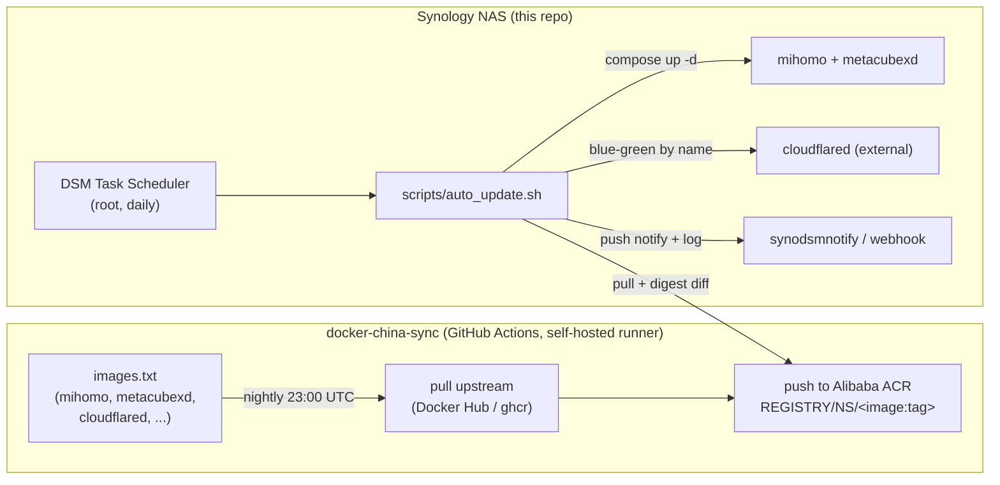

# Architecture

[← README](../README.md) · [中文](zh/architecture.md)
Manual: **Architecture** · [Installation](installation.md) · [Release Zip](release-packaging.md) · [Configuration](configuration.md) · [Auto-Update](auto-update.md) · [Operations](operations.md) · [Troubleshooting](troubleshooting.md) · [Development](development.md)

---

## What this is

A transparent proxy **gateway** for a Synology NAS. [Mihomo](https://github.com/MetaCubeX/mihomo)
(Clash Meta) runs in a privileged container with its **own LAN IP** (Docker macvlan), so any
device on the home network can route through it just by setting that IP as its gateway/DNS —
no client software required. [MetaCubeXD](https://github.com/MetaCubeX/metacubexd) is a web
dashboard for managing Mihomo.

The deployment target is **mainland China**, where Docker Hub / ghcr.io are blocked. Image
updates therefore flow through a two-stage pipeline (mirror → pull) described below.

## Components

| Component | Where | Role |
|---|---|---|
| **mihomo** | this repo, container `mihomo` | The proxy engine. Privileged, on a macvlan with a static LAN IP (`MIHOMO_IP`). Serves DNS on `:53`, the RESTful controller on `:CONTROLLER_PORT`, and proxy ports `7890-7894`. Renders its own config at start from a template. |
| **metacubexd** | this repo, container `mihomo-ui` | Static web dashboard (bridge network, published on the NAS host IP at `WEB_UI_PORT`). A browser talks to the controller directly; the container is just serving the SPA. |
| **cloudflared** | **external** (not in this compose) | Optional Cloudflare Tunnel. Managed *by name* by the auto-updater via blue-green. Lets you reach the dashboard/NAS from outside without opening ports. |
| **auto_update.sh** | this repo, `scripts/` | DSM-scheduled job: pulls images from Alibaba ACR, detects real changes, redeploys safely (health-gate + rollback), notifies. |
| **docker-china-sync** | sibling repo `../docker-china-sync` | GitHub Actions on a self-hosted runner; mirrors upstream images → Alibaba ACR nightly. The "push" side of the pipeline. |

## Update pipeline (mirror → pull)



Plain-text fallback:

```
 docker-china-sync (GitHub Actions)                     Synology NAS (this repo)
 images.txt → pull upstream → push to ACR   ◄──pull──   DSM Task Scheduler → auto_update.sh
   (nightly 23:00 UTC)                                    ├─ compose up -d → mihomo + metacubexd
   ACR: REGISTRY/NS/<image:tag>                           ├─ blue-green → cloudflared (external)
                                                          └─ synodsmnotify + logs/auto-update.log
```

- **Push side** runs in the cloud (good global connectivity) and writes to ACR, which *is*
  reachable from inside China.
- **Pull side** runs on the NAS and only touches ACR. The two sides are decoupled; the NAS
  job is idempotent (it no-ops unless an image digest actually changed), so exact timing
  between them does not matter — just schedule the pull comfortably after the nightly mirror.

## Network model (macvlan)

`scripts/setup_network.sh` creates a Docker **macvlan** network `tproxy_network` whose parent
is the NAS's active interface (auto-detected via the route to `ROUTER_IP`; works with `eth0`
and Open vSwitch `ovs_eth0`). mihomo attaches to it with the static `MIHOMO_IP`, so it appears
as a **first-class device on your LAN** with its own IP — it does not NAT through the NAS host
and does not disturb host networking.

Inside the container, Mihomo enables its `mihomo-tun` interface with `auto-route`. That is the
interception dataplane for packets forwarded by LAN clients; the macvlan address alone only makes
the container reachable and does not transparently proxy traffic. Linux `auto-redirect` is an
optional TCP optimization, disabled by default because current nft-backed iptables userspace is
incompatible with older DSM kernels. The health gate therefore requires the controller **and**
the runtime TUN interface before it reports the gateway healthy.

```
        LAN 192.168.1.0/24
   ┌──────────┬───────────────┬─────────────────┐
 Router     NAS host        mihomo (macvlan)   phone / AppleTV / PS5
192.168.1.1 192.168.1.x   192.168.1.100         set gateway+DNS → .100
                          :53 DNS  :9090 ctl
                          :7890-7894 proxy
```

> **macvlan isolation caveat (important):** by Linux macvlan design, the **NAS host cannot
> reach its own macvlan container's IP**. Other LAN devices can. So always open the dashboard
> and run client connectivity tests from a *different* device, and note that the updater's
> mihomo health probe runs **inside** the container (`docker exec`) precisely to sidestep this.
> See [Troubleshooting](troubleshooting.md#macvlan-self-reach).

## Config rendering

mihomo's real config is generated at container start, never committed:

```
config/config.template.yaml  ──(scripts/render_config.sh)──►  config/config.yaml
        {{TOKENS}}                  + subscription.txt              (gitignored)
        + .env values
```

`scripts/render_config.sh` substitutes the subscription URL (from `config/subscription.txt`)
and the `.env`-provided tokens (`CONTROLLER_*`, `DNS_*`) into the template. The **same script**
is what CI runs (`scripts/ci/render_check.py`), so the rendering path is actually tested. No
DNS server or network address is hardcoded in any committed file (a project rule); real values
live only in the gitignored `.env`. See [Configuration](configuration.md) and
[Development](development.md).

## Safety model ("safe-auto")

This container is the **gateway/DNS for the whole house** — a broken auto-update would take the
LAN offline. So "update automatically" is implemented as *safe-auto*:

1. **detect by digest** — do nothing unless an image actually changed;
2. **preflight** — abort (touching nothing) if compose flavor, image arch, the macvlan network,
   `/dev/net/tun`, or ACR login are not right;
3. **pull-then-swap** — never stop a running container before the new image is fully pulled;
4. **health-gate → auto-rollback** — after recreating, verify mihomo is healthy; if not, revert
   to the last-good image automatically;
5. **blue-green for cloudflared** — bring the new connector up and *prove it is connected*
   before retiring the old one, preserving the tunnel token.

Details in [Auto-Update](auto-update.md).
