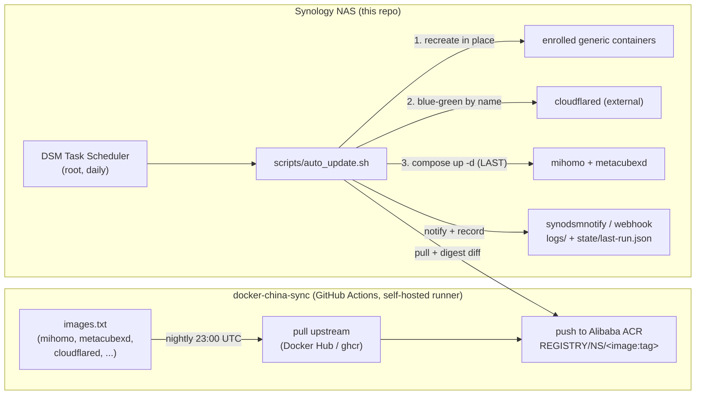

# 架构

[← README](../../README.md) · [English](../architecture.md)
手册：**架构** · [安装](installation.md) · [离线发布包](release-packaging.md) · [配置](configuration.md) · [自动更新](auto-update.md) · [运维](operations.md) · [CLI](cli.md) · [故障排查](troubleshooting.md) · [开发](development.md)

---

## 这是什么

一个透明代理**网关** —— 诞生于群晖 NAS，同样可以部署在任何能运行 Docker 的 Linux 主机
（amd64 + arm64）上。[Mihomo](https://github.com/MetaCubeX/mihomo)
（Clash Meta）运行在一个拥有**自己 LAN IP** 的特权容器中（Docker macvlan），因此家庭网络中
的任何设备只需把该 IP 设为自己的网关/DNS，即可经由它进行路由——无需任何客户端软件。
[MetaCubeXD](https://github.com/MetaCubeX/metacubexd) 是用于管理 Mihomo 的 Web
仪表盘。

| 平台 | Compose 模式（本页拓扑） | Lite 模式（无 Docker） | 支持层级 |
|---|---|---|---|
| **群晖 DSM** | ✓ —— 权威部署 | — | **必须经所有者验证** |
| **树莓派** | ✓（64 位系统，有线以太网） | ✓ | 实验性 |
| **通用 Linux（amd64/arm64）** | ✓（64 位系统、有线以太网、macvlan 可行的网络） | ✓ | 实验性 |

层级定义与各平台完整流程见
[安装 — 通用 Linux 与树莓派](installation-linux.md#支持层级)。

### 权威部署：群晖 DSM

权威部署目标是位于**中国大陆**的群晖 NAS，那里 Docker Hub / ghcr.io 被屏蔽。因此在默认
情况下（`REGISTRY_MODE=acr`），镜像更新通过下文所述的两阶段流水线（镜像同步 → 拉取）
进行；`REGISTRY_MODE=docker` 是一个可选项，直接拉取上游镜像仓库，适用于外网不受限的
主机（也是通用 Linux 安装器提供的默认值）。

## 组件

| 组件 | 位置 | 职责 |
|---|---|---|
| **mihomo** | 本仓库，容器 `mihomo` | 代理引擎。特权运行，位于 macvlan 上并具有静态 LAN IP（`MIHOMO_IP`）。在 `:53` 提供 DNS，在 `:CONTROLLER_PORT` 提供 RESTful 控制器，并提供代理端口 `7890-7894`。启动时基于模板渲染自己的配置。 |
| **metacubexd** | 本仓库，容器 `mihomo-ui` | 静态 Web 仪表盘（桥接网络，发布在 NAS 主机 IP 的 `WEB_UI_PORT` 上）。浏览器直接与控制器通信；该容器只负责提供这个 SPA。 |
| **cloudflared** | **外部**（不在本 compose 中） | 可选的 Cloudflare Tunnel。由自动更新器通过蓝绿方式*按名称*管理。让你无需开放端口即可从外部访问仪表盘/NAS。 |
| **已登记的通用目标** | **外部**（NAS 上的任意容器） | 可选择加入的自动更新目标：通过 `gateway.sh update --enable` 登记的容器，由更新器带分层健康门原地重建。参见[自动更新](auto-update.md)。 |
| **auto_update.sh** | 本仓库，`scripts/` | DSM 计划任务作业：拉取 compose 镜像、cloudflared 以及每一个已登记的通用目标；检测真实变更；按波及面从小到大严格串行应用（健康门 + 回滚）；记录 `state/last-run.json`；发送通知。 |
| **gateway.sh / install.sh** | 本仓库，`scripts/gateway.sh` + `./install.sh` | 基于同一套 `scripts/lib` 函数的运维入口：`gateway.sh` 是非交互 CLI（`deploy` / `redeploy` / `modify` / `cron` / `status` / `doctor` / `update`，root + `--yes` 安全护栏，退出码 0/2/3/4/5/6/7，只读子命令支持 `--json`——参见[命令行参考](cli.md)）；`install.sh` 是交互式 TTY 前端（[安装](installation.md)）。 |
| **数据目录** | **同级目录** `../syno-mihomo-gateway-data` | 持久化的运行时状态（`GATEWAY_DATA_DIR`）：生效的 `.env`、渲染出的配置、日志、更新器状态。替换发布目录后仍然保留。见下文。 |
| **docker-china-sync** | 同级仓库 `../docker-china-sync` | 在自托管 runner 上运行的 GitHub Actions；每晚将上游镜像同步 → 阿里云 ACR。即流水线的"推送"端（在默认的 `REGISTRY_MODE=acr` 下使用）。 |

同一套组件也能跑在**通用 Linux 主机或树莓派**上（`sh ./install-linux.sh` /
`sh ./install-pi.sh`——附加入口；上面的 DSM 路径不受影响），有两种形态：*compose 同构*
（在有线 macvlan 上照搬这套容器拓扑）或*裸机 lite*（mihomo 二进制在 systemd 下运行，
并经 `external-ui` 自己托管面板——没有 Docker、没有 macvlan；客户端的网关/DNS 就是主机
自己的 IP）。硬件下限与模式选择见
[安装 — 通用 Linux 与树莓派](installation-linux.md#硬件与模式矩阵)。

## 持久数据目录

运行时状态保存在发布检出目录的**同级目录**中——`../syno-mihomo-gateway-data`
（可通过 `GATEWAY_DATA_DIR` 重新定位）：

```
../syno-mihomo-gateway-data/
├── .env        # 生效的设置 + 机密（仓库根目录的 .env 只是一次性的迁移来源）
├── config/     # 渲染出的 config.yaml + subscription.txt
├── logs/       # install.log、auto-update.log、gateway.log（各工具各写一份；若 gateway.sh 先运行则链接为同一文件）
└── state/      # update-targets（登记列表）、last-run.json、last-good/<name>
```

这一拆分就是**存活边界**：仓库/发布目录是可替换的（发布压缩包可以直接解压覆盖它），
数据目录则不可替换。由于生效的 `.env` 位于仓库之外，compose 命令总是显式传入它：
`docker compose --env-file ../syno-mihomo-gateway-data/.env ...`。

## 更新流水线（镜像同步 → 拉取）



纯文本回退：

```
 docker-china-sync (GitHub Actions)                     Synology NAS (this repo)
 images.txt → pull upstream → push to ACR   ◄──pull──   DSM Task Scheduler → auto_update.sh
   (nightly 23:00 UTC)                                    ├─ 1. recreate in place → enrolled generic containers
   ACR: REGISTRY/NS/<image:tag>                           ├─ 2. blue-green → cloudflared (external)
                                                          ├─ 3. compose up -d → mihomo + metacubexd (LAST)
                                                          └─ synodsmnotify/webhook + ../syno-mihomo-gateway-data/
                                                             logs/ + state/last-run.json
```

- **推送端**运行在云端（全球连通性良好）并写入 ACR，而 ACR *是*可以从中国境内访问的。
- **拉取端**运行在 NAS 上，且只与 ACR 交互。两端是解耦的；NAS 作业是幂等的（除非镜像
  摘要确实发生变化，否则它什么都不做），因此两者之间的精确时序并不重要——只需把拉取
  安排在每晚镜像同步之后充裕的时间即可。
- **镜像来源可切换。** `REGISTRY_MODE=acr`（默认）使用上述流水线；`REGISTRY_MODE=docker`
  直接拉取上游镜像仓库，并完全跳过 ACR 登录。无论哪种模式，`docker-compose.yml` 都是
  fail-closed 的：镜像引用使用 `${VAR:?}` 形式，因此引用未设置时会直接报错中止部署，
  而不会拉取意料之外的镜像。
- **应用顺序即波及面顺序。** 已变更的镜像严格串行应用：先是已登记的通用容器，然后是
  cloudflared，**最后**才是 compose 网关对——之前的每一步都仍然运行在已知良好的网关之上。

### 通用目标（任意已登记的容器）

除网关三件套外，更新器还可以维护 NAS 上**任何你登记的容器**。登记（`gateway.sh update
--enable NAME` / `--disable NAME`；`state/update-targets` 中每行一条 `name|strategy|probe`
记录）就是资格边界：只有当容器被显式登记**且**已经运行你的 ACR 仓库/命名空间下的镜像时
才会被更新——系统刻意不做上游→ACR 的名称猜测，而网关三件套、由 compose 管理的容器、
命中拒绝列表的容器以及未运行的容器都会被排除并记录原因。（推论：在 `REGISTRY_MODE=docker`
下没有任何通用目标符合资格。）每次应用都是一次 fail-closed 的**捕获 → 重建 → 门控**重放：
容器的规格从 `docker inspect` 捕获，防降级守卫会*拒绝*（容器保持原样）任何它无法忠实重放
的设置，健康门失败时则用保存的规格在 last-good 镜像上恢复。详见[自动更新](auto-update.md)。

## 网络模型 (macvlan)

`scripts/setup_network.sh`——交互式安装器（`sh ./install.sh`）的无头开机自愈同伴——创建
一个名为 `tproxy_network` 的 Docker **macvlan** 网络。其父接口优先使用安装器保存在 `.env`
中的 `PARENT_INTERFACE`（如存在），否则通过到 `ROUTER_IP` 的路由自动检测；它在所有路径上
都会对 Open vSwitch 父接口发出警告，并遵循 `TPROXY_DRIVER`（默认 macvlan，可选 ipvlan——
切换驱动会强制干净地重建网络）；作为开机流程的最后一步，它还会在网关栈已部署却未运行时
用本地镜像把网关栈重新拉起（真正启动失败会以退出码 `2` 结束，从而触发 DSM 开机任务的
失败邮件）。mihomo 以静态 `MIHOMO_IP` 接入该网络，因此它会以
**你 LAN 上的一等设备**的形式出现，拥有自己的 IP——它不会通过 NAS 主机做 NAT，也不会
干扰主机网络。

> **Open vSwitch 说明。** 当父接口是 Open vSwitch 端口（`ovs_eth0`，在 DSM 为 VMM 启用
> Open vSwitch 时出现）时，macvlan 子接口照常工作：在 OVS 父接口上，Docker macvlan 子接口的 IP
> **可被其他局域网设备访问**（已实测——位于某个 macvlan IP 上的干净容器，能从另一台局域网设备
> 应答 ping、ARP 和 HTTP）。OVS **不是**“仪表盘/网关超时”的原因。转发角色应使用 macvlan
> （ipvlan L2 按目的 IP 解复用，不会投递客户端的转发帧），因此请保持 `TPROXY_DRIVER=macvlan`。
> `TPROXY_DRIVER=ipvlan` 仅作为**仪表盘可达性的逃生通道**存在，用于极少数不会把 macvlan
> 子接口的新 MAC 泛洪到对等端口的 OVS 配置（安装器检测到 `ovs_*` 父接口时会给出该选项，
> 默认为否）——它永远不是转发角色的修复手段。
> 见[故障排查](troubleshooting.md)。

这是一个**透明网关**。默认情况下（`TUN_ENABLE=true`）渲染配置带有 `tun:` 块，使用
**`system` TUN 栈**，并配合 `allow-lan: true` 与 `enhanced-mode: fake-ip` DNS。局域网设备
把**网关 + DNS 指向 `MIHOMO_IP`**，即可经机场/订阅出网，无需任何客户端软件。由于设置了
`allow-lan`，它们**也**可以把 `MIHOMO_IP:7890`（http）/ `MIHOMO_IP:7891`（socks）当作显式代理。

关键在于 **`system` 栈**。与带 `auto-route` 的 `stack: mixed`/`gvisor` 不同，`system` 栈**不会**
截走 `external-controller` 的回包，因此 `MIHOMO_IP:CONTROLLER_PORT` 上的仪表盘后端对局域网始终
可达。这才是 [mihomo #1493](https://github.com/MetaCubeX/mihomo/issues/1493) 的真正修复方式：保持
TUN **开启**并使用 `stack: system`，不要关闭 TUN。

设置 `TUN_ENABLE=false` 会去掉 `tun:` 块，让 mihomo 作为**普通（非网关）代理**运行——仅可通过
`redir`/`tproxy`/`mixed`/`socks` 端口访问，不会透明拦截局域网客户端。Linux `auto-redirect`
（`TUN_AUTO_REDIRECT`）是进一步的可选 TCP 优化，默认关闭，因为当前 nft 后端的 iptables 用户态
与较旧的 DSM 内核不兼容。**仅当 `TUN_ENABLE=true` 时**健康门才要求运行时 TUN 网卡；否则只对
控制器把关。

```
        LAN 192.168.1.0/24
   ┌──────────┬───────────────┬─────────────────┐
 Router     NAS host        mihomo (macvlan)   phone / AppleTV / PS5
192.168.1.1 192.168.1.x   192.168.1.100         set gateway+DNS → .100
                          :53 DNS  :9090 ctl
                          :7890-7894 proxy
```

> **macvlan 隔离须知（重要）：** 受 Linux macvlan 设计所限，**NAS 主机无法访问它自己的
> macvlan 容器的 IP**。其他 LAN 设备可以。因此请始终从*另一台*设备打开仪表盘并运行客户端
> 连通性测试，并注意：更新器对 mihomo 的健康探测之所以在容器**内部**运行（`docker exec`），
> 正是为了绕开这一限制。
> 参见[故障排查](troubleshooting.md#macvlan-自访问)。

## 配置渲染

mihomo 的真实配置在容器启动时生成，绝不提交到仓库：

```
config/config.template.yaml ──(scripts/render_config.sh)──► ../syno-mihomo-gateway-data/config/config.yaml
   {{TOKENS}}  (in this repo,        + subscription.txt              (persistent data dir,
   + .env values  mounted read-only)   (same data dir)                never committed)
```

`scripts/render_config.sh` 将订阅 URL（来自
`../syno-mihomo-gateway-data/config/subscription.txt`）以及 `.env` 提供的令牌
（`CONTROLLER_*`、`DNS_*`、`TUN_*`）替换进模板：`TUN_ENABLE` 决定保留还是删除由
`{{TUN_BEGIN}}`/`{{TUN_END}}` 围起的 `tun:` 块，`{{TUN_AUTO_REDIRECT}}` 则是一个被替换的
令牌（两者都按严格的 `true`/`false` 校验），分域解析对决定渲染哪套围栏 DNS 核心——
设置时为境外优先的 v2，未设时为传统 `nameserver`+`fallback` 核心（见
[配置](configuration.md)）。路由是静态 `rules:` 列表（私网目标最先直连，流媒体——视频
与音频服务——→ 可固定的 `Streaming Sites` 选择器，国内直连，境外列表 → `Proxy Mode`
选择器，GEOIP 兜底）。`Proxy Mode` 默认指向 `Country Pick`，其成员是由**必填**的
`COUNTRY_GROUPS` 键生成的 `<Country> Auto` url-test 分组——常规流量骑乘所选国家分组
持有的那一个节点，出口国家因此绝不会自行跳变；隐藏的 `All Nodes` 全池分组只为充当
DNS 绕行锚点而保留（见[配置](configuration.md)）。另有可选的嗅探围栏
（`SNIFFER_ENABLE`）从裸 IP 连接恢复域名，让绕过网关 DNS 的客户端仍按域名路由。
CI 运行的也是**同一个脚本**
（`scripts/ci/render_check.py`），因此渲染路径实际上是经过测试的。由于渲染发生在容器
入口点中，应用模板或订阅的修改需要重建容器：
`docker compose --env-file ../syno-mihomo-gateway-data/.env up -d --force-recreate mihomo`
（或 `sudo sh scripts/gateway.sh redeploy --yes`）。任何已提交的文件中都不会硬编码 DNS
服务器或网络地址（一项项目规则）；真实值仅存在于仓库之外的
`../syno-mihomo-gateway-data/.env` 中（`.gitignore` 条目只是防范仓库内的散落副本）。
参见[配置](configuration.md)与[开发](development.md)。

当可选的 `FULL_PROXY_SOURCES` 网段被设置时，渲染还会额外围栏出一个 **`Full Proxy`**
选择器（成员：`Proxy Mode`——默认——每一个 `<Country> Auto` 分组，以及 `REJECT`；刻意
**不含 `DIRECT`**，网段内设备因此绝不可能被悄悄取消代理），并为每个条目在 **LAN 规则
之后紧邻的位置**拼接一条 `SRC-IP-CIDR` 规则：网段内设备访问局域网目标仍然直连，而其余
一切——流媒体与国内一视同仁——都走 `Full Proxy`。未设时这一切都不渲染，配置保持逐字节
不变（见[配置](configuration.md#全代理设备full_proxy_sources)）。

## 安全模型（"safe-auto"）

该容器是**整个家庭的网关/DNS**——一次失败的自动更新会让整个 LAN 断网。因此"自动更新"
被实现为 *safe-auto*：

1. **先校验，再按摘要检测** —— `.env` 中的更新设置会先行校验，且除非镜像摘要确实发生
   变化，否则什么都不做；
2. **预检** —— 如果 compose 风味、宿主机架构、macvlan 网络、`/dev/net/tun` 或镜像仓库登录
   （ACR 模式）不正确，则中止（不触碰任何东西）；当 `TUN_AUTO_REDIRECT=true` 时，还会用
   一次性网络命名空间做内核兼容性探测，作为 compose 重建的额外门槛（`--dry-run` 只会注明
   它将要运行）；
3. **先拉取再切换** —— 在新镜像完全拉取完成之前，绝不停止正在运行的容器；
4. **按波及面顺序应用** —— 先是已登记的通用目标，然后是 cloudflared，**最后**才是
   compose 网关对；
5. **健康门控 → 自动回滚** —— 重建之后验证健康状况；不健康则回退。compose 网关对回滚到
   上一个正常（last-good）的镜像；每个通用目标都有分层健康门（运行中 → 重启计数稳定 →
   镜像自带 healthcheck → 可选探针），失败时用保存的规格恢复，并在 `state/last-good/` 下
   留有跨运行的 last-good 记录——而且捕获引擎会*拒绝*（容器保持原样）任何它无法忠实重放
   的设置；
6. **针对 cloudflared 的蓝绿** —— 先让新的连接器启动并*证明它已连接*，再退役旧的连接器，
   同时保留 tunnel 令牌；
7. **记录每次运行** —— `state/last-run.json` 会在每一条终止路径上写入（用
   `sudo sh scripts/gateway.sh update --last` 读取）。

`scripts/state_diff.sh` 是第 5 步的验证工具：它使用与更新器重放时**相同的捕获引擎**，对
一次更新前后容器的可重放配置做快照/比对，因此被比对的字段集合*就是*状态保留契约。

详见[自动更新](auto-update.md)。
