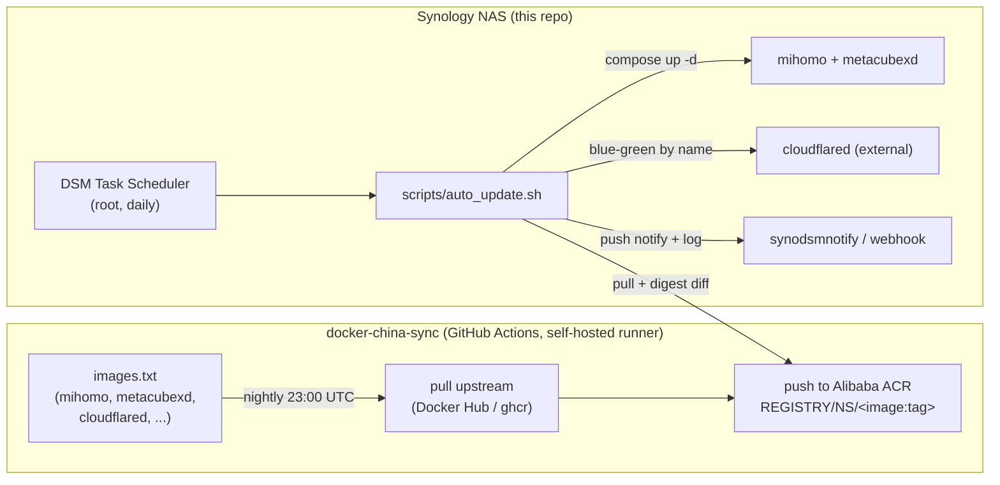

# 架构

[← README](../../README.md) · [English](../architecture.md)
手册：**架构** · [安装](installation.md) · [离线发布包](release-packaging.md) · [配置](configuration.md) · [自动更新](auto-update.md) · [运维](operations.md) · [故障排查](troubleshooting.md) · [开发](development.md)

---

## 这是什么

一个面向群晖 NAS 的透明代理**网关**。[Mihomo](https://github.com/MetaCubeX/mihomo)
（Clash Meta）运行在一个拥有**自己 LAN IP** 的特权容器中（Docker macvlan），因此家庭网络中
的任何设备只需把该 IP 设为自己的网关/DNS，即可经由它进行路由——无需任何客户端软件。
[MetaCubeXD](https://github.com/MetaCubeX/metacubexd) 是用于管理 Mihomo 的 Web
仪表盘。

部署目标是**中国大陆**，那里 Docker Hub / ghcr.io 被屏蔽。因此镜像更新通过下文所述的
两阶段流水线（镜像同步 → 拉取）进行。

## 组件

| 组件 | 位置 | 职责 |
|---|---|---|
| **mihomo** | 本仓库，容器 `mihomo` | 代理引擎。特权运行，位于 macvlan 上并具有静态 LAN IP（`MIHOMO_IP`）。在 `:53` 提供 DNS，在 `:CONTROLLER_PORT` 提供 RESTful 控制器，并提供代理端口 `7890-7894`。启动时基于模板渲染自己的配置。 |
| **metacubexd** | 本仓库，容器 `mihomo-ui` | 静态 Web 仪表盘（桥接网络，发布在 NAS 主机 IP 的 `WEB_UI_PORT` 上）。浏览器直接与控制器通信；该容器只负责提供这个 SPA。 |
| **cloudflared** | **外部**（不在本 compose 中） | 可选的 Cloudflare Tunnel。由自动更新器通过蓝绿方式*按名称*管理。让你无需开放端口即可从外部访问仪表盘/NAS。 |
| **auto_update.sh** | 本仓库，`scripts/` | DSM 计划任务作业：从阿里云 ACR 拉取镜像、检测真实变更、安全地重新部署（健康门控 + 回滚）、发送通知。 |
| **docker-china-sync** | 同级仓库 `../docker-china-sync` | 在自托管 runner 上运行的 GitHub Actions；每晚将上游镜像同步 → 阿里云 ACR。即流水线的"推送"端。 |

## 更新流水线（镜像同步 → 拉取）



纯文本回退：

```
 docker-china-sync (GitHub Actions)                     Synology NAS (this repo)
 images.txt → pull upstream → push to ACR   ◄──pull──   DSM Task Scheduler → auto_update.sh
   (nightly 23:00 UTC)                                    ├─ compose up -d → mihomo + metacubexd
   ACR: REGISTRY/NS/<image:tag>                           ├─ blue-green → cloudflared (external)
                                                          └─ synodsmnotify + logs/auto-update.log
```

- **推送端**运行在云端（全球连通性良好）并写入 ACR，而 ACR *是*可以从中国境内访问的。
- **拉取端**运行在 NAS 上，且只与 ACR 交互。两端是解耦的；NAS 作业是幂等的（除非镜像
  摘要确实发生变化，否则它什么都不做），因此两者之间的精确时序并不重要——只需把拉取
  安排在每晚镜像同步之后充裕的时间即可。

## 网络模型 (macvlan)

`scripts/setup_network.sh` 创建一个名为 `tproxy_network` 的 Docker **macvlan** 网络，其
父接口为 NAS 的活动接口（通过到 `ROUTER_IP` 的路由自动检测；兼容 `eth0` 和 Open vSwitch
`ovs_eth0`）。mihomo 以静态 `MIHOMO_IP` 接入该网络，因此它会以**你 LAN 上的一等设备**
的形式出现，拥有自己的 IP——它不会通过 NAS 主机做 NAT，也不会干扰主机网络。

```
        LAN 192.168.1.0/24
   ┌──────────┬───────────────┬─────────────────┐
 Router     NAS host        mihomo (macvlan)   phone / AppleTV / PS5
192.168.1.1 192.168.1.x   192.168.1.100         set gateway+DNS → .100
                          :53 DNS  :9090 ctl
                          :7890-7894 proxy
```

> **macvlan 隔离须知（重要）：** 受 Linux macvlan 设计所限，**NAS 主机无法访问它自己的
> macvlan 容器的 IP**。其他 LAN 设备可以。因此请始终从*另一台*设备打开仪表盘并运行客户端
> 连通性测试，并注意：更新器对 mihomo 的健康探测之所以在容器**内部**运行（`docker exec`），
> 正是为了绕开这一限制。
> 参见[故障排查](troubleshooting.md)。

## 配置渲染

mihomo 的真实配置在容器启动时生成，绝不提交到仓库：

```
config/config.template.yaml  ──(scripts/render_config.sh)──►  config/config.yaml
        {{TOKENS}}                  + subscription.txt              (gitignored)
        + .env values
```

`scripts/render_config.sh` 将订阅 URL（来自 `config/subscription.txt`）以及 `.env`
提供的令牌（`CONTROLLER_*`、`DNS_*`）替换进模板。CI 运行的也是**同一个脚本**
（`scripts/ci/render_check.py`），因此渲染路径实际上是经过测试的。任何已提交的文件中都不会
硬编码 DNS 服务器或网络地址（一项项目规则）；真实值仅存在于被 gitignore 的 `.env` 中。
参见[配置](configuration.md)与[开发](development.md)。

## 安全模型（"safe-auto"）

该容器是**整个家庭的网关/DNS**——一次失败的自动更新会让整个 LAN 断网。因此"自动更新"
被实现为 *safe-auto*：

1. **按摘要检测** —— 除非镜像确实发生变化，否则什么都不做；
2. **预检** —— 如果 compose 风味、镜像架构、macvlan 网络、`/dev/net/tun` 或 ACR 登录
   不正确，则中止（不触碰任何东西）；
3. **先拉取再切换** —— 在新镜像完全拉取完成之前，绝不停止正在运行的容器；
4. **健康门控 → 自动回滚** —— 重建之后，验证 mihomo 是否健康；如果不健康，则自动恢复到
   上一个正常的镜像；
5. **针对 cloudflared 的蓝绿** —— 先让新的连接器启动并*证明它已连接*，再退役旧的连接器，
   同时保留 tunnel 令牌。

详见[自动更新](auto-update.md)。
